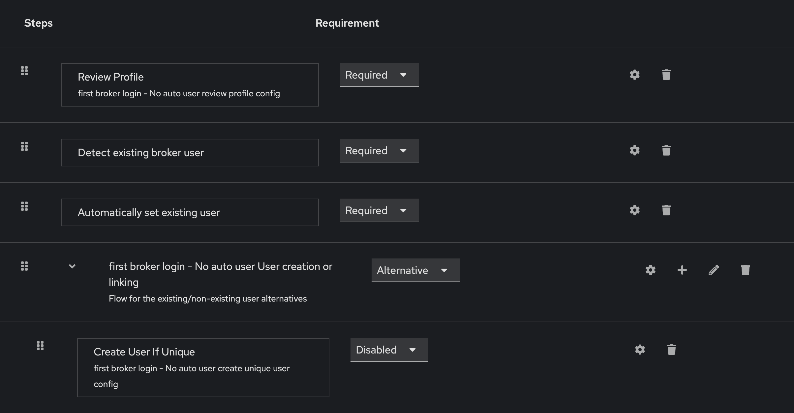

#  PeerSpace

PeerSpace is a real-time 2D spatial virtual office. Walk around as an avatar, meet people in private zones, talk over proximity video/audio, and design the office yourself with the built-in Admin Map Builder.

- [Tech stack](#tech-stack)
- [Quick start (Docker Compose)](#quick-start-docker-compose)
- [Local development without Docker](#local-development-without-docker)
- [Configuration](#configuration)
- [Deployment](#deployment)
- [Keycloak](#keycloak)

---

## Tech stack

| Layer | Technology |
| :--- | :--- |
| Frontend | Vue 3, Tailwind CSS, Lucide icons, HTML5 Canvas |
| Backend | Hono (`@hono/node-server`), Socket.IO, WebRTC signalling |
| Persistence | SQLite (`workspace.sqlite` via `bun:sqlite` / `sql.js`) |
| Auth | OpenID Connect via Keycloak |
| Tooling | Vite, esbuild, TypeScript, Vitest (runs on Bun or Node.js 18+) |

---

## Quick start (Docker Compose)

The compose setup runs everything you need:

| Service | Purpose | URL |
| :--- | :--- | :--- |
| `peerspace` | The app | http://localhost:3000 |
| `keycloak` | Login / identity provider | http://localhost:8080 |
| `keycloak-db` | Postgres database for Keycloak | internal only |

```bash
# 1. Set a session secret (required, see Configuration)
cp .env.example .env
echo "SESSION_SECRET=$(openssl rand -hex 32)" >> .env

# 2. Build and start everything
docker compose up -d --build

# 3. Check the status (Keycloak takes around a minute to become healthy)
docker compose ps
docker compose logs -f keycloak
```

On the first start Keycloak imports the `peer-space` realm from [`keycloak/import/peer-space-realm.json`](keycloak/import/peer-space-realm.json). The import sets up:

- the `peer-space` OIDC client, with its redirect URI pointing to PeerSpace
- a `groups` protocol mapper that puts group membership into the tokens
- an `admin` group

The realm starts with no users. To create one:

1. Open http://localhost:8080 and sign in with `admin` / `admin` (or your `KEYCLOAK_ADMIN_USER` / `KEYCLOAK_ADMIN_PASSWORD`).
2. Switch to the **peer-space** realm, go to **Users** → **Create new user** and set a password under **Credentials**.
3. To make the user a PeerSpace admin (map editing), add them to the **admin** group under **Groups**.
4. Open http://localhost:3000 and log in.

> [!NOTE]
> `docker-compose.override.yml` publishes ports 3000 and 8080 on the host. `docker compose` loads it automatically for local use. Platforms such as Coolify ignore it and route traffic through their own proxy.

> [!TIP]
> Keycloak's memory is capped at 1 GB and Postgres's at 256 MB. If you have more RAM available, raise the caps with `KEYCLOAK_MEM_LIMIT` / `KEYCLOAK_DB_MEM_LIMIT`.

---

## Local development without Docker

Prerequisites: [Bun](https://bun.sh) ≥ 1.0 (or Node.js ≥ 18 with npm), plus a reachable Keycloak. The easiest option is to start only the bundled one: `docker compose up -d keycloak`.

```bash
bun install

# Dev server with watch mode on http://localhost:3000
bun run dev

# Type check & tests
bun run lint
bun run test
```

Outside Docker the server can't resolve the `keycloak` hostname. Set `KEYCLOAK_URL=http://localhost:8080/realms/peer-space` and leave `KEYCLOAK_INTERNAL_URL` unset, so it falls back to `KEYCLOAK_URL`.

---

## Configuration

All variables are documented in [`.env.example`](.env.example). The most important ones:

### PeerSpace

| Variable | Description | Default (compose) |
| :--- | :--- | :--- |
| `SESSION_SECRET` | Signs session tokens after login. **Set this.** If it's empty, a random secret is generated at boot and every restart logs everyone out. | – |
| `KEYCLOAK_URL` | Realm URL as the **browser** sees it | `http://localhost:8080/realms/peer-space` |
| `KEYCLOAK_INTERNAL_URL` | Realm URL as the **server** sees it (token exchange, userinfo). Defaults to `KEYCLOAK_URL` when unset. | `http://keycloak:8080/realms/peer-space` |
| `KEYCLOAK_CLIENT_ID` | OIDC client ID | `peer-space` |
| `KEYCLOAK_CLIENT_SECRET` | OIDC client secret. **Change this outside local dev.** | `peer-space-dev-secret` |
| `PORT` | HTTP port inside the container | `3000` |
| `DATA_DIR` | Where the SQLite database is stored | `/app/data` (volume `peerspace_data`) |
| `VITE_ICE_SERVERS` / `VITE_TURN_*` | STUN/TURN servers for WebRTC. Baked in at build time. You need TURN if users sit behind restrictive NATs or firewalls. | Google STUN |

### Bundled Keycloak

| Variable | Description | Default |
| :--- | :--- | :--- |
| `KEYCLOAK_PUBLIC_URL` | Public base URL of Keycloak. Tokens are issued for this URL. | `http://localhost:8080` |
| `PEERSPACE_URL` | Public URL of PeerSpace (the client's redirect URI) | `http://localhost:3000` |
| `KEYCLOAK_ADMIN_USER` / `KEYCLOAK_ADMIN_PASSWORD` | Initial admin console account | `admin` / `admin` |
| `KEYCLOAK_DB_PASSWORD` | Postgres password | `keycloak` |
| `KEYCLOAK_MEM_LIMIT` / `KEYCLOAK_DB_MEM_LIMIT` | Container memory caps | `1g` / `256m` |

> [!IMPORTANT]
> Keycloak reads `KEYCLOAK_CLIENT_ID`, `KEYCLOAK_CLIENT_SECRET` and `PEERSPACE_URL` only on the **first** realm import. Once the realm exists, the database holds these settings. Change them in the Keycloak admin console, or run `docker compose down -v` to wipe the database and re-import (this deletes all users).

---

## Deployment

### Docker Compose (e.g. Coolify)

`docker-compose.yml` is ready for production. Put a TLS-terminating reverse proxy in front of both `peerspace` and `keycloak`, then set at least:

```env
SESSION_SECRET=<openssl rand -hex 32>
PEERSPACE_URL=https://peerspace.example.com
KEYCLOAK_PUBLIC_URL=https://auth.example.com
KEYCLOAK_URL=https://auth.example.com/realms/peer-space
KEYCLOAK_CLIENT_SECRET=<openssl rand -hex 32>
KEYCLOAK_ADMIN_PASSWORD=<strong password>
KEYCLOAK_DB_PASSWORD=<strong password>
```

Keycloak trusts `X-Forwarded-*` headers (`KC_PROXY_HEADERS=xforwarded`), so make sure your proxy sets them.

### Using an external Keycloak

To use an existing Keycloak instead of the bundled one, remove the `keycloak` and `keycloak-db` services. Then point both URLs at your realm:

```env
KEYCLOAK_URL=https://cloak.example.com/realms/<realm>
KEYCLOAK_INTERNAL_URL=https://cloak.example.com/realms/<realm>
KEYCLOAK_CLIENT_ID=<client>
KEYCLOAK_CLIENT_SECRET=<secret>
```

Configure the client as described in [Admin permissions](#admin-permissions).

### Plain Docker

```bash
docker build -t peerspace .
docker run -d --name peerspace -p 3000:3000 \
  -v peerspace_data:/app/data -e DATA_DIR=/app/data \
  -e SESSION_SECRET="$(openssl rand -hex 32)" \
  -e KEYCLOAK_URL="https://cloak.example.com/realms/peer-space" \
  -e KEYCLOAK_CLIENT_ID="peer-space" \
  -e KEYCLOAK_CLIENT_SECRET="<secret>" \
  peerspace
```

### Without Docker

```bash
bun run build   # Vite client build to dist/, esbuild server bundle to dist/server.js
bun dist/server.js
```

### Health check

```bash
curl http://localhost:3000/api/health
# {"status":"ok","activeUsers":0}
```

---

## Keycloak

### Admin permissions

PeerSpace scans the OIDC userinfo and token payloads for an `admin` or `/admin` entry in `groups`, `roles`, `realm_access`, `resource_access` or custom claims. Users with that entry get admin rights, including map editing.

The bundled realm already has this configured. For an external Keycloak, add a group mapper to your client:

1. **Clients** → your client → **Client scopes** → the dedicated scope → **Add mapper** → **By configuration** → **Group Membership**
2. Set **Name** / **Token Claim Name** to `groups`, turn **Full group path** on, and turn **Add to ID token**, **Add to access token** and **Add to userinfo** on.
3. Create an `admin` group and add your admins to it.

Without the mapper, `groups` contains only Keycloak's default roles (`default-roles-*`, `offline_access`, `uma_authorization`), and no one becomes an admin.

### Identity provider brokering (first broker login)

When users log in through an external identity provider (Google Workspace, another OIDC broker, …), you may want to stop Keycloak from creating accounts automatically. To do that, use a **First Broker Login – No Auto User** flow under **Authentication**:



| Step | Execution | Requirement |
| :--- | :--- | :--- |
| 1 | **Review Profile** (`first broker login - No auto user review profile config`) | `Required` |
| 2 | **Detect existing broker user** | `Required` |
| 3 | **Automatically set existing user** | `Required` |
| 4 | **first broker login - No auto user User creation or linking** | `Alternative` |
| 5 | **Create User If Unique** (`first broker login - No auto user create unique user config`) | `Disabled` |
